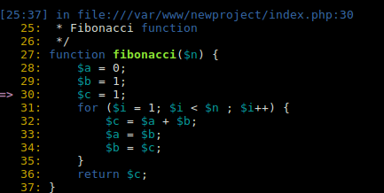

[](https://travis-ci.org/tacnoman/dephpugger) [](https://codeclimate.com/github/tacnoman/dephpug)

# What is Dephpugger?

Dephpugger (read depugger) is an open source lib to make a debug in php direct in terminal, without necessary configure an IDE. The dephpugger run in Php Built in Server using another command.

  
`Image 1.0 - Screenshot for dephpugger`

# Install

To install you must run this code (using the composer).

```sh
$ composer require tacnoman/dephpugger
```

# Dependencies

- PHP 7.0 or more (not tested in older versions)
- Xdebug activate

# Usage

To usage you must (after installation) run two binaries in `vendor/bin` folder.

```sh
$ php vendor/bin/debugger # Server running in port 8888
$ php vendor/bin/dbgp-client # Debugger waiting debug
```

You must run in two different tabs (in next version you'll can run in an uniq tab).
After run theese commands, you need to put the follow line in your code:

```php
<?php

# ...
xdebug_break(); # This code is a breakpoint like ipdb in Python and Byebug in Ruby
# ....
```

After this, you can open in your browser the page (localhost:8888/[yourPage.php]).
When you request this page your terminal will start in breakpoint (like a image 1.0).

## Comands after run

When you stop in a breakpoint you can make theese commands:

| Command           | Explanation                                                          |
|-------------------|----------------------------------------------------------------------|
| n                 | To run a step over in code                                           |
| s                 | To run a step into in code                                           |
| c                 | To continue script until found another breakpoint or finish the code |
| $variable         | Get a value from a variable                                          |
| $variable = 33    | Set a variable                                                       |
| my_function()     | Call a function                                                      |
| dbgp(\<command\>) | To run a command in dbgp                                             |
| quit              | Exist the debugger                                                   |

# DEVELOPING YET!

[Documentation in github pages](https://tacnoman.github.io/dephpugger)

# Run tests

```sh
$ codecept run unit
```

# Bugs?
Send me an email or open an issue:

Renato Cassino - Tacnoman - \<renatocassino@gmail.com\>

# PHP DEBUG

To use Xdebug in PHPStorm, you must put this configuration:

- Run/Debug Configuration > Click in "+".
- Select PHP Built-In Web Server

In server Configuration:
- Host: localhost
- Port: 8080

In Command Line:
- Interpreter options: -dxdebug.remote_enable=1 -dxdebug.remote_mode=req -dxdebug.remote_port=9000 -dxdebug.remote_host=127.0.0.1 -dxdebug.remote_connect_back=0

Click in Apply/Ok.
Push Play button.
Click on Start Listening for Php Debug Connections.

Download this extension:
https://chrome.google.com/webstore/detail/xdebug-helper/eadndfjplgieldjbigjakmdgkmoaaaoc

Open helper and select PhpStorm in IDE key.


In Terminal you can run:
/usr/bin/php -S localhost:8888 -t /var/www/phpdebug -dxdebug.remote_enable=1 -dxdebug.remote_mode=req -dxdebug.remote_port=9000 -dxdebug.remote_host=127.0.0.1 -dxdebug.remote_connect_back=0
